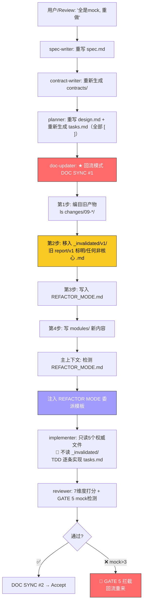

# 场景 7: Spec 回流重构

> **模拟**: 用户发现已有实现几乎全是 mock，要求回流 spec 从 plan 重新开始。这涉及物理隔离旧产物、委派注入和重新实现。

---

## 用户视角

```
用户: "这个 09-model-management 几乎全是 mock/_CAPABILITIES_BY_TYPE，
      实际功能一个都没实现。重做。"

Agent: 🛑 确认目标变更。当前实现全是 mock 占位，
        需回流 spec → plan → 重新实现。
        开始回流...
```

---

## 系统内部流程



---

## 关键新增: 物理隔离步骤

```
回流前（implementer 会看到的混乱状态）:
  docs/changes/09-model-management/
    ├── spec.md (v2)
    ├── implementation-report-v1.md   ← "Feature X 已完成 ✅"
    ├── review-report-v1.md           ← "评分 4.0 ✅"
    └── tasks-v1.md                   ← 80% [x]

  结果: implementer 读到旧 report → 上下文爆炸 → 零行代码

回流后 DOC SYNC #1（物理隔离）:
  docs/changes/09-model-management/
    ├── REFACTOR_MODE.md              ← 标记文件
    ├── spec.md                       ← 最新权威
    ├── design.md                     ← 最新方案
    ├── tasks.md                      ← 全部 [ ]
    ├── contracts/                    ← 最新契约
    └── _invalidated/
        └── v1/
            ├── implementation-report-v1.md  ← 已隔离
            ├── review-report-v1.md          ← 已隔离
            └── tasks-v1.md                  ← 已隔离

  结果: implementer 只看到5个权威文件，直接按 tasks.md 逐条实现
```

---

## implementer 委派注入

```
主上下文委派 implementer:

⚠️ REFACTOR MODE — 此 change 已回流 v1 次，需从头重做

工作目录: docs/changes/09-model-management/
当前权威文件（只需读这些）:
  - spec.md           ← 最新权威规格
  - design.md         ← 最新设计方案
  - tasks.md          ← 全部 [ ]，需从头实现
  - contracts/        ← 最新接口契约
  - closure-checklist.md ← 闭环清单

🛑 禁止:
  - 进入 _invalidated/ 目录
  - 读取任何 "v1"、"report"、"review" 文件
  - 对比新旧差异
  - 假定 "以前做过"

MUST:
  - 按 tasks.md 逐条 TDD 实现
  - 完成后输出 Completion Report
```

---

## 回流的 3 种触发方式

| 触发 | 时机 | 处理 |
|------|------|------|
| Review 发现全 mock（GATE 5 FAIL） | Phase 7 Review | 回流 spec → 走完整回流流程 |
| 用户中途喊停 "全是 mock" | 任意阶段 | feedback-loop → 确认 → 回流 |
| 归档后用户发现问题 | Phase 7 归档后 | 创建新 change（不回流，解封禁止） |

---

## 完整协议

> 三层防御（物理隔离 + 委派注入 + 归档门禁）+ 回流流程 → [references/refactor-protocol.md](../references/refactor-protocol.md)
