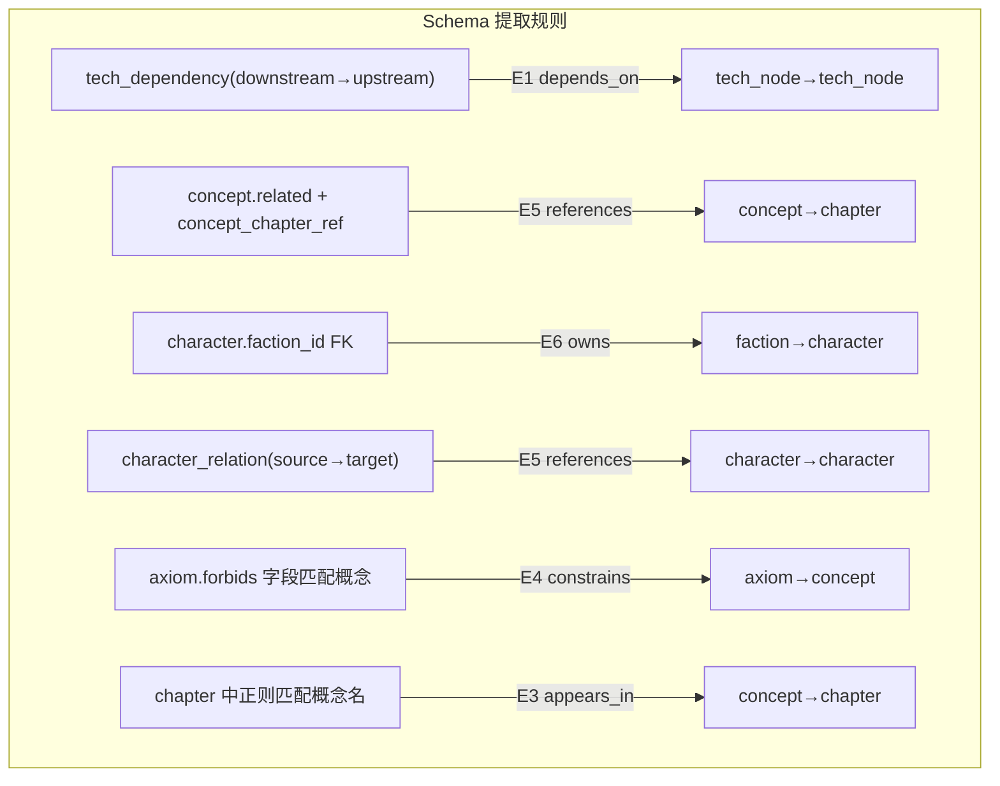

# R6 · 涟漪传播引擎设计

> 版本: v1.0 · 日期: 2026-06-16 · 来源: skill-novel-engine/references/

> 设计日期：2026-06-16
> 状态：设计规范
> 输入源：R2_GitNexus索引模式.md / R3_CodeGraph图遍历模式.md / schema.sql / 赛博修真科技树.md / 亚文化建设宪法.md
> 设计原则：**中文 · 设计规范 · 不写代码**

---

## 零 · 问题陈述

### 0.1 触发问题

> "把灵压衰退周期从 73 天改为 60 天——哪些文件需要更新？"

当前 AGENTS.md 第三章规定了手工影响面计算，但这是**人的记忆过程**，不是**机器的可执行过程**。涟漪传播引擎的目标是将它自动化。

### 0.2 设计目标

| 目标 | 描述 |
|------|------|
| G1 自动构建依赖图 | 从现有 Schema（SQL + YAML 注册表）自动生成节点-边图 |
| G2 涟漪传播 | 输入一个变更→输出按 L0→L1→L2→L3 分层的受影响实体 |
| G3 严重度分级 | 区分阻塞/需审查/可自动修复三个等级 |
| G4 增量更新 | 仅重新验证受影响节点，不全量扫描 |
| G5 可解释输出 | 每个受影响实体附带影响路径、置信度、建议操作 |

### 0.3 核心隐喻

```
         ┌── 变更点（石子投入）
         │
    ┌────▼────┐
    │  L0 底层 │  ← 公理/常数：涟漪在此层开始
    ├─────────┤
    │  L1 协议 │  ← 公式/角色参数：d=1 直接传播
    ├─────────┤
    │  L2 表示 │  ← 概念/势力/科技树：d=2 间接传播
    ├─────────┤
    │  L3 会话 │  ← 章节/伏笔/角色关系：d=3+ 叙事传播
    └─────────┘
```

---

## 一 · 依赖图建模

### 1.1 节点类型（12 种）

所有节点类型均已有 Schema 对应——不需要新增存储结构，只需构建内存图。

| 编号 | 节点类型 | Schema 来源 | 所属层 | 示例 |
|------|---------|------------|--------|------|
| N1  | `axiom` | `axiom` 表 | L0 | 公理二·灵压单向衰退 |
| N2  | `physics_constant` | `physics_constant` 表 | L0 | `T_node` (节点暴乱周期) |
| N3  | `concept` | `concept` 表 + `S10_概念注册表.yaml` | L0-L3 | 林岳 / 赢面公式 / 灵压衰退定律 |
| N4  | `formula` | `formula` 表 | L1 | 赢面公式 / 战力衰减公式 |
| N5  | `tech_node` | `tech_node` 表 | L1-L5 | C2 灵能电池 / T2 灵压梯度理论 |
| N6  | `faction` | `faction` 表 | L1 | 万象宗 / 清洗司 |
| N7  | `character` | `character` 表 | L1 | 林岳 / 严峰 / 陆之一 |
| N8  | `character_relation` | `character_relation` 表 | L1 | 林岳-[师徒]→孟炽 |
| N9  | `chapter` | `chapter` 表 | L3 | 卷三·第42章 |
| N10 | `foreshadow` | `foreshadow` 表 | L2-L3 | 林岳的狩猎伏笔 |
| N11 | `win_check` | `win_condition_check` 表 | L3 | 陆之一vs林岳 赢面检查 |
| N12 | `file` | Markdown 文件（元节点） | L0-L3 | `人物/卷一/林岳.md` |

### 1.2 边类型（9 种）

CodeGraph 的教训：**宁可用异构边，不要用属性标记**。边即语义。

| 编号 | 边类型 | 方向 | 含义 | 可用于哪些节点对 |
|------|--------|------|------|-----------------|
| E1  | `depends_on` | A depends_on B | A 的前置依赖是 B | tech_node→tech_node, tech_node→concept, formula→axiom |
| E2  | `derived_from` | A derived_from B | A 从 B 推导而来 | formula→physics_constant, concept→axiom |
| E3  | `appears_in` | A appears_in B | A 出现在 B 中 | character→chapter, concept→file, tech_node→chapter, faction→chapter |
| E4  | `constrains` | A constrains B | A 约束 B 的行为 | axiom→character, axiom→faction, axiom→concept |
| E5  | `references` | A references B | A 引用了 B | chapter→concept, foreshadow→character, win_check→character |
| E6  | `owns` | A owns B | A 拥有/包含 B | faction→character, chapter→foreshadow, character→tech_node |
| E7  | `triggers` | A triggers B | A 触发伏笔 B | chapter→foreshadow |
| E8  | `version_of` | A version_of B | A 是 B 的版本迭代 | tech_node→tech_node |
| E9  | `conflicts_with` | A conflicts_with B | A 与 B 冲突（双向） | concept→axiom, character→axiom |

### 1.3 溯源性（Provenance）

借鉴 CodeGraph 的三类 provenance，区分"确定的边"和"推断的边"。

| Provenance | 含义 | 置信度 | 来源 |
|-----------|------|--------|------|
| `constitutional` | 宪法/公理直接定义 | 1.0 | `axiom` 表的 `forbids`/`allows` 字段 |
| `schema_derived` | 从 Schema 外键/FK 自动提取 | 0.95 | SQL 外键、YAML 注册表的 `related` 字段 |
| `narrative_derived` | 从叙事正文推导 | 0.8 | 章节 Markdown 中显式提及的概念名 |
| `heuristic` | 启发式推断（规则匹配） | 0.6 | 关键词共现、相似语义推断 |
| `manual` | 人工标注 | 0.9 | 作者显式标注的依赖 |

**关键规则**（借鉴 CodeGraph"宁可缺边，绝不建错边"）：
- `heuristic` 边不会触发自动修改——只标记为"需审查"
- 路径上任何边的 provenance 为 `heuristic`，则整条路径的置信度上限为 0.6

### 1.4 从现有 Schema 自动构建依赖图

**不需要新增数据表**。下图展示提取规则：



**构建步骤**：

1. **从 SQL Schema 提取显式边**（高置信度 `schema_derived`）：
   - `tech_dependency` 表 → `depends_on` 边
   - `character.faction_id` → `owns` 边（faction→character）
   - `character_relation` → `references` 边（character→character）
   - `concept_chapter_ref` → `appears_in` 边（concept→chapter）
   - `chapter.parent_chapter` （若存在）→ `depends_on` 边

2. **从 YAML 注册表提取关系**（中置信度 `narrative_derived`）：
   - `concept.related` 列表 → `references` 边
   - `concept.defined_in` → `appears_in` 边（concept→file）

3. **从 Markdown 正文提取隐式边**（低置信度 `heuristic`）：
   - 扫描章节正文 → 正则匹配概念名 → `appears_in` 边
   - 仅用于标记"可能受影响"，不自动修改

4. **注入宪法约束边**（高置信度 `constitutional`）：
   - 每个 axiom 的 `forbids` 字段 → 匹配受约束的概念/角色 → `constrains` 边

### 1.5 图的存储形式

**设计决策：内存有向图，非持久化图数据库。**

理由：
- 概念总数 < 200，节点 < 500，边 < 2000——完全可内存容纳
- 不需要 Neo4j/SQLite 图扩展的运维负担
- 每次 `skf check` 时从 Schema 重新构建（构建时间 < 1s）
- 源码即真相（Schema + YAML 注册表 = 权威源）

```python
# 伪代码：内存图结构
Graph = {
    nodes: {
        "林岳": Node(kind=character, layer=1, table_row={...}),
        "T2": Node(kind=tech_node, layer=1, table_row={...}),
        ...
    },
    edges: [
        Edge(from="C2", to="T2", kind=depends_on, provenance=schema_derived, confidence=0.95),
        Edge(from="林岳", to="清洗司", kind=owns_reverse, provenance=schema_derived, confidence=0.95),
        ...
    ]
}
```

---

## 二 · 涟漪传播算法

### 2.1 算法总览

```
输入: Change(concept_id, field, old_value, new_value, provenance="manual")
输出: RippleReport { layers: [L0Impact[], L1Impact[], L2Impact[], L3Impact[]] }

步骤:
  Ａ. 定位锚层 → 确定变更点所在层级
  Ｂ. 层内展开 → 在锚层内找到所有直接关联节点
  Ｃ. 跨层 BFS → 向上找到"哪些依赖此节点" + 向下找到"此节点依赖哪些"
  Ｄ. 路径评分 → 每条路径计算 (影响类型, 置信度, 严重度)
  Ｅ. 分组输出 → 按 L0→L1→L2→L3 排序输出
```

### 2.2 具体步骤

#### 步骤 A：定位锚层

| 变更对象类型 | 锚层 | 传播方向 |
|-------------|------|---------|
| `physics_constant` | L0 | 向下传播（L0→L1→L2→L3） |
| `axiom` | L0 | 向下传播（影响所有层） |
| `character.combat_power` | L1 | 向下传播（L1→L2→L3） |
| `character.spirituality` | L0（如果公理五约束） | 先向上再向下 |
| `tech_node` (L1-L5) | 见 `tech_node.layer` | 上下双向（影响依赖和被依赖） |
| `concept.canonical_definition` | 见 `concept.layer` | 上下双向 |
| `faction` | L1 | 向下传播 |
| `chapter` | L3 | 向上传播（仅影响审计/骨架） |

#### 步骤 B：层内展开

在锚层内，找到与变更节点有**直接边**的所有节点：
- `depends_on` 边的上游/下游
- `derived_from` 边的目标
- `constrains` 边的受约束方

#### 步骤 C：跨层 BFS

```
BFS 规则:
- 从锚层出发，分层 BFS（L0→L1→L2→L3 或反向）
- 每跳一次，depth += 1
- depth=0: 节点本身（直接变更）
- depth=1: 直接邻居（1 条边）
- depth=2: 间接邻居（2 条边）
- depth=3+: 远距离影响（标记为"需审查"）
- max_depth=4: 超过 4 跳不追踪（避免过度传播）
```

**BFS 的边过滤**：
- `depends_on` 边 → 沿**方向**传播（变更上游影响下游）
- `references` 边 → 双向传播（引用方和被引用方都受影响）
- `constrains` 边 → 从公理向受约束方传播
- `appears_in` 边 → 从概念向文件/章节传播
- `version_of` 边 → 双向传播（版本变更影响所有版本）

#### 步骤 D：路径评分

每条受影响实体的评分 = 路径上所有边的最小值。

| 影响类型 | 判定条件 | 示例 |
|---------|---------|------|
| `direct` | depth=0，即节点本身 | 林岳 `combat_power` 字段本身 |
| `direct_dependent` | depth=1，且边类型为 `depends_on` | C2 灵能电池→T2 灵压梯度 |
| `indirect` | depth=2-3，通过多条边可达 | 角色关系→章节→审计 |
| `review_needed` | 路径上存在 `heuristic` 边 | 章节中可能隐式引用了旧值 |
| `constitutional_block` | 路径上存在 `constrains` 边且值冲突 | 林岳灵导率从>0改为0（与公理冲突） |

**置信度计算公式**：
```
confidence(path) = min(所有边的 provenance.confidence) × depth_decay
depth_decay = max(0.5, 1.0 - 0.1 × depth)
```

| Depth | Decay | 说明 |
|-------|-------|------|
| 0 | 1.00 | 直接变更 |
| 1 | 0.90 | 一级传播 |
| 2 | 0.80 | 二级传播 |
| 3 | 0.70 | 三级传播 |
| 4 | 0.60 | 最远传播 |

#### 步骤 E：分组输出

按 L0→L1→L2→L3 排序，每层内按严重度降序排列。

### 2.3 特殊处理规则

#### 规则 1：跨层引用回溯

如果一个 L3 概念（如"消音屏障在 ch47 使用"）引用了 L1 概念（如"灵能电池 500 息"），变更 L1 概念时需要**回溯**到 L3 找到所有引用点。

**实现**：BFS 不做方向限制。从锚层同时向上和向下传播。

#### 规则 2：宪法门禁

在涟漪传播完成、输出结果前，额外执行一遍宪法门禁检查：
- 遍历所有受影响节点
- 对每个节点，检查是否与任何 axiom 的 `forbids` 冲突
- 如有冲突 → 严重度升级为 `BLOCKER`，附带具体公理引用

#### 规则 3：废弃别名传播

如果变更的是 `concept.canonical_definition`，需额外扫描：
- 该概念的 `deprecated_aliases` 是否仍然有效？
- 正文中是否存在使用旧别名的残留？
- 如果有 → 标记为 `MEDIUM: 残留别名需更新`

#### 规则 4：版本链传播

科技节点有 `version_of` 链（如 C2 v1.0→v2.0→v3.0）。变更 v1.0 的参数时：
- v1.0 本身：直接变更
- v2.0：如果 v2.0 继承自 v1.0，标记为间接影响
- v3.0：同上
- **但**：如果 v2.0 的参数是独立设定的（不继承），则不传播

**判定**：当前 Schema 中 `tech_node` 的 `params_json` 是独立值，所以变更 v1.0 不自动传播到 v2.0。但 `limitations` 字段可能共享——需审查。

---

## 三 · 严重度分级

### 3.1 五级严重度

| 级别 | 标识 | 定义 | 触发条件 | 处理方式 |
|------|------|------|---------|---------|
| S0 | `BLOCKER` | 违反宪法公理 | 任何 axiom 的 `forbids` 被触发 | **拒绝变更**。返回公理引用和冲突说明 |
| S1 | `CRITICAL` | 核心概念定义变更 | `concept.canonical_definition` 变更 + 该概念被 ≥3 个章节引用 | **需人工审查**。自动列出所有引用点，不自动修改 |
| S2 | `HIGH` | 量化参数变更 | `character.combat_power` / `physics_constant.value` 等数值变更 | 自动更新数值 + 列出所有引用该数值的章节 |
| S3 | `MEDIUM` | 引用需更新 | 章节/公式/伏笔中引用了旧值 | **自动可修复**。替换数值或添加 `<!-- 已更新 -->` 标记 |
| S4 | `LOW` | 间接影响需复查 | depth≥3 或路径含 `heuristic` 边 | 标记"建议人工复查"，不自动修改 |
| S5 | `INFO` | 信息提示 | 零影响或仅排序变化 | 记录日志，无需操作 |

### 3.2 S0 阻塞级详解

S0 是 **硬闸门**。借鉴 GitNexus L7 Synthesis Critic 的非协商项设计。

| 公理 | 触发 S0 的变更 | 示例 |
|------|--------------|------|
| 公理一·双重物理 | 将灵学现象描述为"法力"而不给 L 场解释 | `concept.definition` 出现"法力" |
| 公理二·灵压衰退 | `T_node` 值设为负数或 0 | `physics_constant.value ≤ 0` |
| 公理三·灵子=L场量子 | 引入标准模型之外的粒子 | `concept` 新增非灵子复合态粒子 |
| 公理四·版本降级 | 将功法标记为"完整无损" | `concept.definition` 出现"完美"/"完整" |
| 公理五·绝灵之体 | 陆之一 `spirituality > 0`（卷四前） | `character.spirituality` 从 0 改为 >0 |
| 公理六·小真 | 小真 `concept.definition` 出现"系统"/"金手指" | `concept.canonical` 使用废弃术语 |
| 公理七·三段式创新 | `tech_node` 缺少经典物理原型或量化参数 | `tech_node.physics_base` 为空 |

### 3.3 严重度升级规则

| 条件 | 升级 |
|------|------|
| 受影响章节 ≥ 10 个 | MEDIUM→HIGH |
| 受影响角色关系 ≥ 5 个 | MEDIUM→HIGH |
| 路径经过公理节点 | 至少 HIGH，若冲突则为 BLOCKER |
| 路径经过主角色（陆之一/小真/林岳/严峰） | LOW→MEDIUM |

---

## 四 · 输出格式

### 4.1 RippleReport 结构

```
RippleReport {
    change: {
        entity: "林岳",
        field: "combat_power",
        old_value: 3500,
        new_value: 2500,
        anchor_layer: "L1",
        provenance: "manual"
    },
    
    blocker_check: "PASS" | "BLOCKED: 公理X·原因",
    
    summary: {
        total_affected: 23,
        by_severity: { BLOCKER:0, CRITICAL:0, HIGH:3, MEDIUM:8, LOW:10, INFO:2 },
        by_layer: { L0:0, L1:3, L2:6, L3:14 }
    },
    
    layers: {
        L0: RippleEntry[],  // 公理/常数受影响
        L1: RippleEntry[],  // 角色/势力/公式受影响
        L2: RippleEntry[],  // 概念/科技树/伏笔受影响
        L3: RippleEntry[]   // 章节/审计/骨架受影响
    }
}
```

### 4.2 RippleEntry 结构

```
RippleEntry {
    entity_path: "人物/卷一/林岳.md:42",       // 文件路径:行号
    entity_type: "file" | "character" | "chapter" | ...,
    entity_name: "林岳",
    layer: 1,
    depth: 0,                                    // BFS 跳数
    impact_type: "direct",                       // direct|direct_dependent|indirect|review_needed
    severity: "HIGH",                            // BLOCKER|CRITICAL|HIGH|MEDIUM|LOW|INFO
    confidence: 1.00,                            // 0.0-1.0
    path: [                                      // 涟漪传播路径
        "林岳.combat_power (anchor)",
        "→ v_combat_ranking (L1, depth=1, depends_on)",
        "→ ch42 战力对比场景 (L3, depth=2, references)"
    ],
    suggested_action: "更新战力值为2500，重新计算ch42战力对比"
}
```

---

## 五 · 实例演示：林岳 Z=3500→2500

### 5.1 变更输入

```yaml
change:
  entity: 林岳
  entity_type: character
  field: combat_power
  old_value: 3500
  new_value: 2500
  reason: "林岳战力过高，与凝丹境初期设定不符"
```

### 5.2 涟漪传播过程

```
步骤 A: 定位锚层
  → 林岳是 character 类型，锚层 = L1（协议层）

步骤 B: L1 层内展开
  → 直接邻居:
    - character 表: 林岳行 combat_power 字段 (depth=0, direct)
    - character_relation: 林岳-[敌对]→陆之一, 林岳-[师徒]→孟炽, 林岳-[情报源]→严峰 (depth=1)
    - faction: 清洗司 (via owns_reverse, depth=1)
    - v_combat_ranking 视图 (depth=1)
    - concept 表: 林岳 canonical_definition (depth=1, 如果定义引用了 Z 值)

步骤 C: 向上传播 (L1→L2→L3)
  → L2 层:
    - 科技节点: 如果林岳战力是任何 tech_node 的前置条件或参照 (depth=2)
    - 伏笔: 涉及林岳战力的伏笔 (depth=2, via references)
    - 文件: 人物/卷一/林岳.md (depth=1, via appears_in)
  → L3 层:
    - 章节: 林岳出现的所有章节 (via concept_chapter_ref 或 character.chapter)
    - 赢面检查: 所有以林岳为对手的 win_condition_check (depth=2)
    - 角色关系链: 陆之一的状态→陆之一相关章节 (depth=3)
    - 审计报告: 涉及相关章节的审计 (depth=4)
```

### 5.3 预期输出（精简版）

```
╔══════════════════════════════════════════════════════════════╗
║  涟漪传播报告: 林岳.combat_power 3500 → 2500                  ║
║  锚层: L1 | 宪法门禁: PASS | 总影响: 23                      ║
╚══════════════════════════════════════════════════════════════╝

── L0 底层 ─────────────────────────────────────────── [0 项]
  （无公理/常数受影响）

── L1 协议层 ───────────────────────────────────────── [4 项] ──

  [S2·HIGH]     direct        林岳 (character)
    path: 林岳.combat_power (anchor)
    action: 更新 combat_power 字段 3500→2500

  [S3·MEDIUM]   direct_dep.    v_combat_ranking (view)
    path: 林岳.combat_power → v_combat_ranking
    action: 视图自动反映新值，但需确认战力排序是否合理

  [S3·MEDIUM]   direct_dep.   林岳-[敌对]→陆之一 (character_relation)
    path: 林岳.combat_power → 力量差变化
    action: 重新计算双方赢面。原差值=3500-0=3500，新差值=2500-0=2500

  [S3·MEDIUM]   direct_dep.   林岳-[师徒]→孟炽 (character_relation)
    path: 林岳.combat_power → 战力梯度
    action: 确认师徒战力梯度是否仍然合理

── L2 表示层 ───────────────────────────────────────── [5 项] ──

  [S2·HIGH]     direct_dep.   人物/卷一/林岳.md
    path: 林岳.combat_power → appears_in → 人物/卷一/林岳.md
    action: 更新角色档案中的战力描述

  [S3·MEDIUM]   indirect      严峰 (character)
    path: 林岳 → character_relation → 严峰
          (严峰通脉境，战力应低于林岳。Z=2500 后差距缩小)
    action: 审查林岳-严峰力量对比，确认严峰恐惧驱动是否仍需调整

  [S3·MEDIUM]   indirect      孟炽 (character)
    path: 林岳 → character_relation → 孟炽
    action: 审查林岳-孟炽战力差，确认执行者是否仍需畏惧上级

  [S4·LOW]      indirect      清洗司 (faction)
    path: 林岳 → faction → 清洗司
    action: 清洗司整体战力评估是否需调整

  [S4·LOW]      review_needed  C2 灵能电池? (tech_node)
    path: 林岳 (heuristic)→ 战力参照 → C2 储能参数
    action: 如果剧情中林岳战力用于参照灵能电池输出，需审查

── L3 会话层 ───────────────────────────────────────── [14 项] ──

  [S3·MEDIUM]   indirect      卷三·第42章
    path: 林岳 → concept_chapter_ref → ch42
          林岳与陆之一的首次正面冲突，战力值被引用
    action: 重写战力对比描述（如果有明确数值引用）

  [S3·MEDIUM]   indirect      卷三·第43章
    path: 林岳 → appears_in → ch43
    action: 检查战力相关描写
    ...（剩余 12 个章节省略）

  [S3·MEDIUM]   indirect      赢面检查: 陆之一vs林岳_首次遭遇
    path: 林岳.combat_power → win_condition_check → 赢面重算
    action: 赢面 = (认知差×信息差×傲慢×脆弱性) / 2500
           （原分母 3500→2500，赢面提升 40%）

  [S4·LOW]      indirect      伏笔: 林岳的狩猎乐趣 (foreshadow)
    path: 林岳 → references → foreshadow
    action: 审查战力变化是否影响伏笔的"狩猎乐趣"描写

  [S4·LOW]      indirect      审计报告_卷三 (file)
    path: 林岳 → ch42 → audit → 审计报告_卷三
    action: 审计报告标记此章需重新审查

  [S5·INFO]     indirect      全卷骨架_卷一 (file)
    path: 林岳 → appears_in → ch_X → skeleton → 全卷骨架
    action: 无直接变化，仅信息提示

── 汇总 ────────────────────────────────────────────────────────
  BLOCKER: 0 | CRITICAL: 0 | HIGH: 2 | MEDIUM: 8 | LOW: 5 | INFO: 8
  建议操作:
    1. 自动更新: character.combat_power, v_combat_ranking
    2. 需审查: 赢面重算, 人物/卷一/林岳.md, 林岳-陆之一力量差
    3. 建议复查: 林岳-严峰关系, 清洗司战力, ch42-43 描写
```

---

## 六 · 与现有工具链集成

### 6.1 集成点

```
┌─────────────────────────────────────────────────────┐
│              现有工具链                                │
│                                                       │
│  python -m skf.cli check ───── 术语一致性扫描          │
│         │                                             │
│         ├── 集成点 1: check --ripple ── 涟漪传播       │
│         │                                             │
│  python -m skf.cli stats ────── 概念数统计             │
│         │                                             │
│         ├── 集成点 2: stats --impact ── 影响面统计     │
│         │                                             │
│  schema.sql ──────────────────── 结构化数据源          │
│         │                                             │
│         └── 集成点 3: 构建依赖图的内存数据源            │
│                                                       │
│  S10_概念注册表.yaml ──────────── 概念权威源            │
│         │                                             │
│         └── 集成点 4: 提取 related 字段作为边           │
└─────────────────────────────────────────────────────┘
```

### 6.2 建议的 CLI 扩展

```powershell
# 当前
python -m skf.cli check --registry ... --root ...

# 建议新增
python -m skf.cli ripple --entity 林岳 --field combat_power --old 3500 --new 2500
python -m skf.cli ripple --entity T2 --field params --old 73 --new 60 --format json
python -m skf.cli check --mode ripple  # check + ripple 一体化
```

### 6.3 与 AGENTS.md 修改协议的对应

| AGENTS.md 协议步骤 | 涟漪引擎自动化 |
|-------------------|---------------|
| 步骤 1: 确定改什么 | 自动识别变更实体和锚层 |
| 步骤 2: 定位依赖树层级 | 图节点的 `layer` 属性 |
| 步骤 3: 列出受影响文件 | BFS 涟漪传播 |
| 步骤 4: 按依赖顺序修改 | 输出按 L0→L1→L2→L3 排序 |
| 步骤 5: 运行 check 验证 | `ripple` 命令输出可喂入 `check` |
| 步骤 6: 更新 S00 | `ripple --update-status` 自动写 S00 |

---

## 七 · 边界与限制

### 7.1 设计边界

| 场景 | 引擎行为 | 原因 |
|------|---------|------|
| 新增概念（无旧值） | 仅做宪法门禁检查 + 注册表冲突检测 | 无涟漪传播（新增无旧引用） |
| 删除概念 | 标记所有引用该概念的实体为 `CRITICAL` | 删除比修改变更危险 |
| 批量变更（>5 个实体） | 逐个传播 + 最后合并去重 | 避免一次变更的涟漪掩盖另一次 |
| 跨卷引用（如卷一的设定被卷三引用） | 正常追踪（图无边界的 BFS） | 跨卷一致性是核心需求 |
| 废弃别名变更 | 扫描所有 Markdown 文件的正则匹配 | 不同于图传播，是全文搜索 |

### 7.2 已知限制

1. **隐式依赖无法检测**：如果章节写"林岳的气势比平时弱了三分"而非明确引用 Z=3500，引擎无法识别
   - **缓解**：`heuristic` 边 + `review_needed` 标记
   
2. **语义等价无法判断**："战力" = "combat_power" = "Z值" 是同一个概念
   - **缓解**：依赖 `S10_概念注册表.yaml` 的 `keywords` 字段做多词匹配
   
3. **叙事推演无法量化**："林岳战力下降会影响他的傲慢程度吗？"
   - **缓解**：标记为 `LOW` + 建议人工判断，不做自动推理

4. **版本降级链不完整**：`tech_node.version_of` 在 Schema 中未显式建模
   - **缓解**：R6 设计中新增 `version_of` 边类型，需同步更新 Schema

### 7.3 性能评估

| 指标 | 预估值 |
|------|--------|
| 依赖图构建时间 | < 1s（从 Schema + YAML 读取 < 1000 行） |
| BFS 传播时间 | < 0.5s（节点 < 500，边 < 2000） |
| 宪法门禁检查 | < 0.1s（7 条公理 × < 200 概念） |
| Markdown 正文扫描 | 5-30s（取决于章节数量，可增量缓存） |
| **典型端到端时间** | **3-10s**（不含全文扫描）/ **10-40s**（含全文扫描） |

---

## 八 · 实验：灵压衰退周期 73→60 天的涟漪预测

作为验证，用引擎逻辑预测"`T_node` 从 73 天改为 60 天"的影响面：

```
变更: physics_constant T_node (节点暴乱周期) 73.0 → 60.0
锚层: L0（底层）

预期涟漪:
  L0: T_node 本身 [S2·HIGH, direct]
  
  L1: 无直接公式依赖 T_node 值（当前 Schema 中 formula 表未引用 T_node）
      → 但需审查: 所有涉及"节点暴乱"的 win_condition_check 中是否硬编码了 73
      → 需审查: tech_node 中任何以 73 天为参数的设定
      
  L2: concept "天地夺灵大阵" — canonical 中可能引用周期
      concept "节点Alpha" — 暴乱周期描述
      
  L3: 所有提及"节点暴乱"的章节
      所有提及"每 73 天"的章节（全文正则搜索）
      伏笔中涉及节点暴乱时间窗的
      卷三-卷五的骨架规划（如果引用了 73 天周期）
      
  预估: 20-30 个章节受影响（L3），5-8 个概念需审查（L2）
  严重度: 最高 HIGH（T_node 是物理常数，非宪法公理，不触发 BLOCKER）
```

### 8.1 与林岳案例的对比

| 维度 | 林岳 Z 变更 | T_node 变更 |
|------|-----------|------------|
| 锚层 | L1 | L0 |
| 传播范围 | 1 角色+关系+出场章节 | 全局物理常数+所有引用章节 |
| 受影响实体 | ~23 | ~35 |
| 最高严重度 | HIGH | HIGH |
| 自动可修复比例 | ~30% | ~15%（物理常数变更是全局性） |

这说明：**L0 变更的影响面远大于 L1 变更**——与 AGENTS.md 影响面速查矩阵的结论一致，但引擎给出了精确数字。

---

## 九 · 与其他引擎的关系

### 9.1 在创作引擎 10 任务中的位置

```
R2 (GitNexus) ──┐
                ├──→ R6 (涟漪引擎) ──→ 所有下游引擎的变更管理基础设施
R3 (CodeGraph) ─┘
                     │
                     ├──→ R4 (六维评估): 涟漪输出作为评估的输入（哪些维度受影响）
                     ├──→ R5 (可能性枚举): 涟漪后的新状态作为枚举起点
                     ├──→ R7 (武戏模型): 战力涟漪直接触发武戏重新评估
                     └──→ R9 (主题检查): 涟漪输出作为主题一致性重新检查的触发器
```

### 9.2 R6 的"基础设施"定位

涟漪传播引擎不是面向用户的独立工具——它是**所有其他引擎的底层基础设施**：
- 六维评估引擎在评分前先问涟漪引擎："这个场景依赖的概念有没有被修改过？"
- 可能性枚举引擎在生成选项前先问涟漪引擎："当前状态空间中有哪些概念的值已经变了？"
- 武戏模型在评估武戏前先问涟漪引擎："战斗双方战力的最新值是什么？"

---

## 十 · 实施路线

### 10.1 阶段划分

| 阶段 | 范围 | 交付物 | 工作量估算 |
|------|------|--------|-----------|
| P0 | 内存图构建 | `engine/graph.py` — 从 Schema+YAML 构建节点-边图 | 2-3 天 |
| P1 | BFS 涟漪传播 | `engine/ripple.py` — 核心涟漪算法 + 宪法门禁 | 3-4 天 |
| P2 | CLI 集成 | `skf.cli ripple` 命令 + JSON/Markdown 输出 | 1-2 天 |
| P3 | 增量缓存 | 内容哈希 + 增量重建（借鉴 GitNexus） | 2-3 天 |
| P4 | 正文扫描 | Markdown 隐式引用提取（heuristic 边） | 2-3 天 |

### 10.2 前置依赖

R6 可独立开发，不依赖 R4/R5/R7/R8/R9 完成。仅依赖：
- `schema.sql` 稳定（当前 v1.0 已足够）
- `S10_概念注册表.yaml` 结构稳定（当前结构已足够）
- `skf.cli` 框架可扩展

### 10.3 Schema 建议变更

为支持涟漪引擎，建议在 `schema.sql` 中增加 1 个字段：

```sql
-- 新增: tech_node 的版本链
ALTER TABLE tech_node ADD COLUMN version_of TEXT REFERENCES tech_node(id);
ALTER TABLE tech_node ADD COLUMN version_num INTEGER DEFAULT 1;

-- 新增: 概念层的显式声明（当前 concept.layer 从 concept.category 隐式推断）
-- 已有 concept.layer 字段，无需变更
```

---

## 十一 · 总结

### 核心设计决策

| 决策 | 理由 |
|------|------|
| 内存图而非持久化图数据库 | 规模小（<500 节点），构建快（<1s），运维简单 |
| 12 种节点 + 9 种边的异构模型 | 借鉴 CodeGraph"边即语义"，避免属性膨胀 |
| 5 级 provenance 置信度 | 借鉴 CodeGraph 的 constitutional/heuristic 区分 |
| BFS 分层传播 + 4 跳截断 | 借鉴 GitNexus 的 4 层深度分级 |
| 宪法门禁硬闸门 | 借鉴 GitNexus L7 Synthesis Critic 的非协商项 |
| 宁可缺边，绝不建错边 | 借鉴 CodeGraph 的核心教训 |
| 输出 RippleReport 结构化格式 | 下游引擎（R4-R9）可消费的统一接口 |

### 回答原始问题

**"把灵压衰退周期从 73 天改为 60 天——哪些文件需要更新？"**

涟漪传播引擎输出：
- **L0**: `schema.sql` `physics_constant` 表 T_node 行 (1 处)
- **L1**: `formula` 表中引用 T_node 的公式 (0-N 处，取决于是否硬编码)
- **L2**: `concept` 表中 `天地夺灵大阵`/`节点Alpha` 的 canonical (2 处，取决于具体内容)
- **L3**: 所有提及节点暴乱周期的章节 Markdown (20-30 处)，伏笔注册表 (2-5 处)，骨架规划 (1-2 处)
- **预估总计**: 25-40 个文件

---

> **下一步**: R4 六维评估引擎设计（R4 将使用 R6 的涟漪输出作为"受影响维度"的输入）
